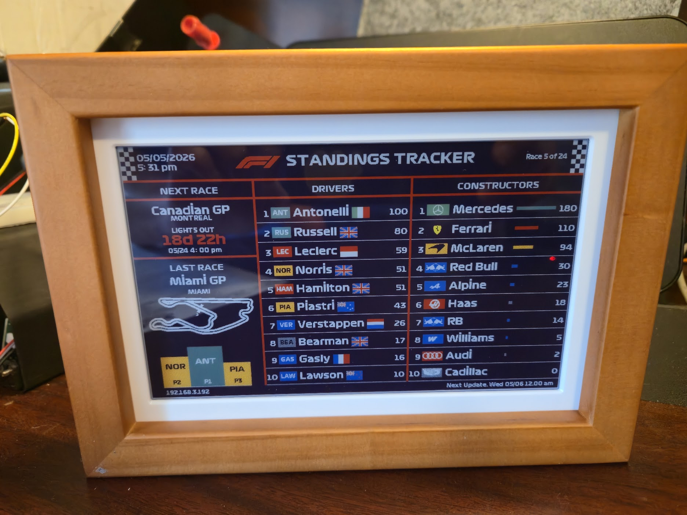

# F1 Tracker (Large / PhotoPainter)

<p align="center">
  
</p>

Custom firmware for the **[Waveshare ESP32-S3 PhotoPainter](https://www.waveshare.com/wiki/ESP32-S3-PhotoPainter)** — a desk display that keeps Formula 1 context on the built-in **7.3″ six-color e-paper** (800×480: black, white, green, blue, red, yellow). This project replaces the stock photo-frame demo with a **race-aware dashboard**: calendar, standings, grid, podium, countdown, optional audio, and a browser-based settings UI.

| Resource | Link |
|----------|------|
| **Board wiki (hardware, assembly, flashing)** | [ESP32-S3-PhotoPainter — Waveshare Wiki](https://www.waveshare.com/wiki/ESP32-S3-PhotoPainter) |
| **Product page** | [Waveshare ESP32-S3 PhotoPainter](https://www.waveshare.com/esp32-s3-photopainter.htm) |
| **User guide (this firmware)** | [USER_GUIDE.md](USER_GUIDE.md) |
| **Admin page reference** | [ADMIN_PAGE.md](ADMIN_PAGE.md) — every setting at `http://<device-ip>/` |
| **QA checklist** | [TESTING_GUIDE.md](TESTING_GUIDE.md) |

   

---

## Features

### E-paper UI (800×480)

- **Three-column layout** — next race + countdown, last race + optional **circuit map**, podium; driver or **starting grid**; constructor standings with team-colored bars.
- **Formula 1–style embedded fonts** — custom bitmap type (U8g2 bridge on Adafruit GFX).
- **Race states** — countdown to lights-out, **RACE IN PROGRESS** banner, grid when qualifying exists near race time, podium TLAs when results are posted.
- **Header / footer** — local date & time (12h or 24h), Wi‑Fi IP, **next scheduled refresh**, **battery %** with white gauge (via AXP2101 PMIC).
- **Optional boot splash** — F1 logo + quote on power-up (toggle in web UI).

### Data & scheduling

- **Live F1 JSON** via Ergast-compatible **[jolpi.ca](https://api.jolpi.ca/)** (`api.jolpi.ca/ergast/f1/...`) — calendar, driver/constructor standings, qualifying, results.
- **Phase-based refresh** — update cadence speeds up near race weekend (race window, grid-search phase, hourly mid/far phases); all tunable in the admin UI.
- **Multi-level HTTP caching** — configurable TTLs for calendar, standings, qualifying, and availability probes.
- **NTP time sync** — countdown and scheduler use local wall clock (default TZ in firmware: US Eastern; change `MY_TZ` in `src/main.cpp`).

### Web admin (`http://<device-ip>/`)

Browser UI on port **80** with tabs for:

| Tab | Controls |
|-----|----------|
| **Schedule** | Race-window minutes, grid-search minutes, mid/far hourly spacing, race-window hours, grid-display hours, phase boundaries |
| **Audio & time** | Volume, boot / loaded / update WAV picks from SD, **quiet hours**, 24h clock |
| **API cache** | Cache minutes for calendar, standings, qualifying, qual/results availability probes |
| **Wi‑Fi** | SSID/password, **keep Wi‑Fi on** (off = radio sleeps between refreshes; admin page unreachable until next reconnect) |
| **SD & system** | Upload/browse/delete on SD, mkdir, boot splash, **redraw (cached data)**, **force refresh**, **reboot** |

See **[USER_GUIDE.md](USER_GUIDE.md)** for display behavior and **[ADMIN_PAGE.md](ADMIN_PAGE.md)** for every admin control.

### Audio (ES8311 + microSD)

- **I²S codec** on the PhotoPainter board; **16-bit WAV** files under `/sound/` on the SD card.
- **Boot** — after Wi‑Fi connects (default: theme / `boot.wav`).
- **Loaded** — after first successful e-paper draw.
- **Update** — after scheduled or manual data refresh (skipped when celebration plays).
- **Results celebration** — when official **race results first appear** for the current GP, plays the **same clip as boot** once per round (`celebrRound` in prefs).
- **Quiet hours** — suppress WAV playback in a local-time window.

Sample assets are in the repo [`sound/`](sound/) folder (copy to the card; match names in the web UI).

### SD card assets (optional)

| Folder | Purpose |
|--------|---------|
| `/sound/*.wav` | Boot, loaded, update, celebration clips |
| `/flags/XX.raw` | Driver nationality flags (ISO code, e.g. `gb.raw`) |
| `/tracks/<circuit>.raw` | Circuit silhouettes (Montreal / Villeneuve auto-rotated & scaled in firmware) |
| `/logos/<team>.raw` | Constructor badge artwork |

Conversion helpers live under [`misc/`](misc/) and [`images/`](images/).

### Power & reliability

- **AXP2101 PMIC** ([XPowersLib](https://github.com/lewisxhe/XPowersLib)) — rail bring-up, battery %, charging indicator in UI; **I²C retry** on boot if the first probe fails.
- **Boot reset reason** logged on serial (`[RST] …`) for debugging unexpected USB reconnects.
- **Wi‑Fi provisioning** — [WiFiManager](https://github.com/tzapu/WiFiManager) captive portal: `F1Tracker-Setup` / `formula1`.

---

## Hardware

Designed for the **[ESP32-S3 PhotoPainter](https://www.waveshare.com/wiki/ESP32-S3-PhotoPainter)** only — integrated **7.3″ E6 color e-paper**, **ESP32-S3**, **AXP2101** power management, **ES8311** audio, and **microSD**. Do not expect a bare ESP32-S3 DevKit + random panel to work without porting pin maps and drivers.

| Item | Detail |
|------|--------|
| Resolution | 800 × 480 |
| Colors | Black, white, green, blue, red, yellow |
| PMIC | AXP2101 on I²C (GPIO 47 SDA / 48 SCL) |
| Flash / PSRAM | 16 MB flash, PSRAM enabled (`platformio.ini`) |

Pin map (firmware):

| Function | GPIO |
|----------|------|
| EPD CS / DC / RST / BUSY | 9 / 8 / 12 / 13 |
| EPD SCK / MOSI | 10 / 11 |
| I²C SDA / SCL | 47 / 48 |
| I²S (see `src/f1_audio.h`) | MCLK 14, BCLK 15, LRCK 16, DOUT 17, … |
| SD SPI | CS 38, CLK 39, MISO 40, MOSI 41 |

Board setup, mechanical assembly, and stock-demo flashing are documented on the **[Waveshare wiki](https://www.waveshare.com/wiki/ESP32-S3-PhotoPainter)** (schematics, resources, FAQ).

---

## Prerequisites

1. **[PlatformIO](https://platformio.org/)** — VS Code extension or CLI  
2. **[ESP32-S3 PhotoPainter](https://www.waveshare.com/wiki/ESP32-S3-PhotoPainter)** with USB data cable  
3. **microSD** (recommended) — sounds and optional graphics  
4. **USB drivers** — native USB-CDC on S3 (see Waveshare wiki if the port does not appear)

---

## Build and upload

From the project root:

```bash
pio run -t upload
pio device monitor -b 115200
```

Or:

```bash
pio run -t upload && pio device monitor
```

### Serial port

If upload fails, set your port in `platformio.ini`:

```ini
upload_port = COM5        ; Windows
monitor_port = COM5
```

Linux/macOS: e.g. `/dev/ttyACM0`.

### Optional build flags (`platformio.ini`)

```ini
; Continue boot if AXP2101 missing (wrong board / debug only — may not power rails on real PhotoPainter):
; -DF1_PMIC_SKIP_ON_FAIL=1
```

---

## First-time setup

1. **Flash** firmware (above).  
2. **Wi‑Fi** — if no saved credentials, join AP **`F1Tracker-Setup`** / password **`formula1`**, open **`http://192.168.4.1`**, pick your network.  
3. **Admin** — open **`http://<device-ip>/`** (IP on serial log and footer when connected).  
4. **SD** — copy WAVs to `/sound/`; optional flags, tracks, logos (see [USER_GUIDE.md](USER_GUIDE.md)).  
5. **Timezone** — edit `MY_TZ` in `src/main.cpp` if not US Eastern.

### README photo

Add your device photo as **`images/readme-photo.jpg`** (Google Photos links cannot be embedded on GitHub). See [images/README-photo.md](images/README-photo.md).

---

## Repository layout

| Path | Purpose |
|------|---------|
| `src/main.cpp` | E-paper driver, UI, API, scheduler, web server |
| `src/f1_fonts.c` / `.h` | Embedded F1-style fonts |
| `src/f1_audio.h` | I²S, ES8311, SD WAV playback |
| `src/track_reader.h` | Circuit maps from SD (incl. Villeneuve rotation) |
| `src/logo_reader.h` | Flags & constructor logos from SD |
| `platformio.ini` | Board, 16 MB flash, libraries |
| `sound/` | Sample WAV/MP3 for SD |
| `misc/` | Flag generation, raw assets |
| `images/` | Bitmap conversion tooling |

---

## Dependencies (PlatformIO)

- [XPowersLib](https://github.com/lewisxhe/XPowersLib) — AXP2101 PMIC  
- Adafruit GFX + [U8g2_for_Adafruit_GFX](https://github.com/olikraus/U8g2_for_Adafruit_GFX)  
- [ArduinoJson](https://arduinojson.org/) 6.x  
- [WiFiManager](https://github.com/tzapu/WiFiManager)  

---

## Troubleshooting

| Symptom | What to try |
|---------|-------------|
| **`AXP2101 not found`** / probe retries | Unplug USB, cold boot, better cable/port; see serial `[PMIC]` lines. Real PhotoPainter should reach **`PMIC ok`**. |
| **USB connect/disconnect sounds** | Usually MCU **reset loop** — check serial **`[RST] Reset reason=…`** ([USER_GUIDE.md](USER_GUIDE.md) — USB section). Try powered USB, disable USB selective suspend. |
| **Upload fails** | COM port, cable, [Waveshare flashing notes](https://www.waveshare.com/wiki/ESP32-S3-PhotoPainter#Firmware_Flashing_Instructions) |
| **Blank / corrupt EPD** | Stable 5 V supply during refresh (~12 s full refresh per Waveshare spec) |
| **No admin page** | **Keep Wi‑Fi on** disabled → radio off between updates; wait for next refresh or enable always-on |
| **No sound** | SD mounted; 16-bit WAV; volume / quiet hours; `/sound/` paths in web UI |
| **Stale data** | Force refresh in web UI; cache TTLs; [jolpi.ca](https://api.jolpi.ca/) reachability |

Serial tags: `[F1]`, `[PMIC]`, `[WiFi]`, `[HTTP]`, `[Sched]`, `[CAL]`, `[Audio]`, `[RST]`.

---

## Credits

- **Hardware** — [Waveshare ESP32-S3 PhotoPainter](https://www.waveshare.com/wiki/ESP32-S3-PhotoPainter)  
- **F1 data** — Ergast-style API via [jolpi.ca](https://api.jolpi.ca/)  
- **Graphics** — Adafruit GFX + U8g2  
- **Wi‑Fi setup** — WiFiManager  

---

**Enjoy the build.**
